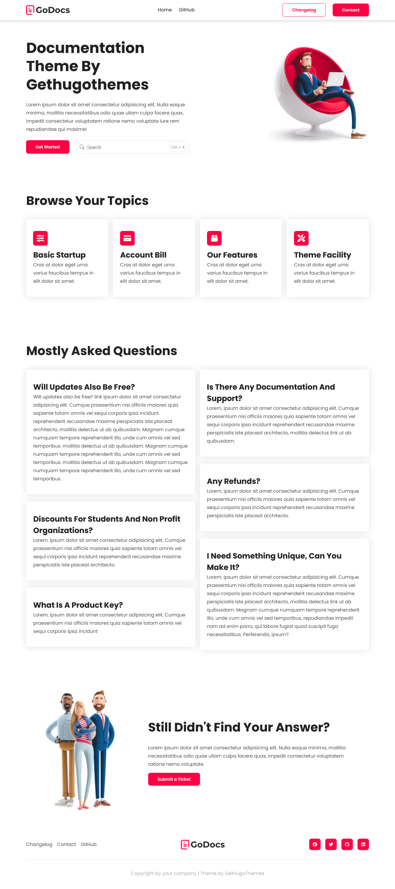
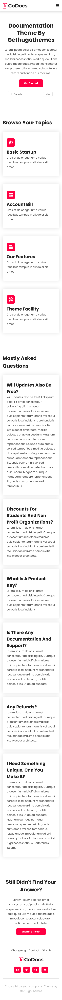

This is an implementation of the [GoDocs](https://demo.gethugothemes.com/godocs/site/style-1/) templete by Get Hugo Themes

## Screenshot

<table>
 <tr>
    <th width="75%">Desktop</th>
    <th width="25%" >| Mobile</th>
  </tr>
  <tr>
    <td></td>
    <td></td>
  </tr>
</table>

## Links

- Live Site URL: [Netlify](https://godocs-implementation.netlify.app)

## Built with

- Semantic HTML5 markup
- CSS custom properties
- Vanilla JavaScript
- Flexbox
- CSS Grid
- Media Queries
- FontAwesome Icons
- Mobile-First Workflow

## Author

- Linkedin - [Alyaa Ahmed](https://www.linkedin.com/in/alyaa-ahmed/)
